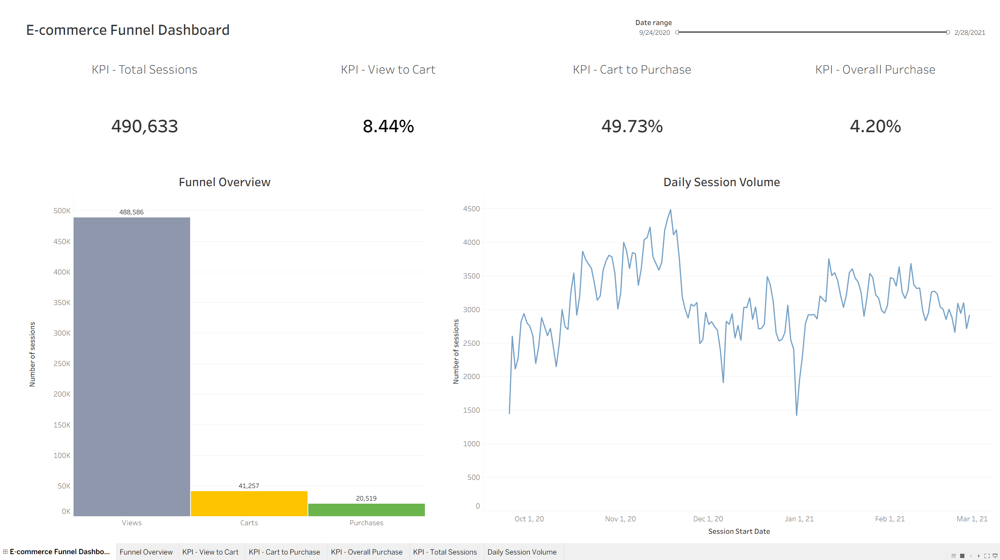

# E-commerce Funnel Analytics: Understanding User Drop-off Before Purchase

## Project Overview

| Item | Value |
|------|-------|
| Industry | E-commerce |
| Business Area | Product and Conversion Analytics |
| Source Dataset Size | 885,129 Event Records |
| Current Analytical Dataset Size | 884,312 Event Records |
| Analysis Level | Event and User Session |
| Primary Analysis Tool | Python |
| Notebook Environment | Jupyter Notebook |
| Visualization | Tableau Public |
| Skills | Python · pandas · Data Cleaning · Exploratory Data Analysis · Funnel Analysis · Data Visualization |

## Project Goal

Analyze the e-commerce customer journey to understand how users move through the conversion funnel, identify the main drop-off points before purchase, and uncover opportunities to improve conversion.

The project transforms event-level behavioral data into business-focused insights, with emphasis on funnel performance, user behavior, conversion patterns, and actionable recommendations for product and growth teams.

## Business Problem

E-commerce platforms collect large volumes of behavioral events, but the raw event stream does not immediately explain how users progress from product discovery to purchase.

The Product Analytics team needs to understand which stages of the shopping journey generate the highest drop-off, which categories or products show conversion opportunities, and when users are most engaged with the platform.

The objective of this project is to analyze historical e-commerce event data to:

- measure the volume of views, cart actions, and purchases;
- calculate conversion rates across the main funnel stages;
- identify session-level abandonment patterns;
- compare funnel performance across categories, brands, products, and time periods;
- identify high-view and low-purchase opportunities;
- provide actionable recommendations for improving the shopping experience.

This analysis focuses on descriptive and diagnostic analytics. Its purpose is not to build a predictive machine learning model, but to provide a clear understanding of where users drop off and which business areas may require further investigation.

## Dataset

The dataset contains **885,129 event records** from an electronics e-commerce store and includes behavioral, product, category, brand, price, user, and session information.

Each row represents a single user event and includes information such as:

- event timestamp;
- event type;
- product identifier;
- category identifier and category code;
- brand;
- product price;
- user identifier;
- user session identifier.

The main event types used in this project are:

- `view`: product viewed by a user;
- `cart`: product added to the shopping cart;
- `purchase`: product purchased by a user.

### Analytical Scope

The original file is an event-level dataset. A single user can generate multiple events, and a single session can contain multiple views, cart actions, and purchases.

The analysis will therefore use two complementary levels:

- **Event level:** understand activity volume, product behavior, categories, brands, and time patterns.
- **Session level:** build the funnel using the combination of `user_id` and `user_session`, and measure whether an analytical session included a view, cart action, and purchase.

The raw dataset is kept unchanged. The current preparation logic removes fully duplicated records, standardizes missing category and brand values as `Unknown`, creates category hierarchy fields, and excludes records without a session identifier from session-level funnel calculations.

### Data Source

The dataset was obtained from Kaggle:

- **Dataset:** “eCommerce events history in electronics store”
- **Author:** REES46 Marketing Platform
- **Source:** [View the dataset on Kaggle](https://www.kaggle.com/datasets/mkechinov/ecommerce-events-history-in-electronics-store)

The dataset is used for educational and portfolio purposes.

The raw and processed CSV files are excluded from the public repository because of GitHub file-size limits. To reproduce the analysis, download the dataset and save it locally as `data/events.csv`.

## Data Quality Assessment

Before performing the funnel analysis, the source dataset was assessed to verify its completeness, consistency, and suitability for analysis.

The validation process included:

- confirming the total number of source records and columns;
- reviewing the available event, product, user, and session fields;
- checking missing values in category, brand, and session attributes;
- validating event type values;
- identifying fully duplicated rows;
- converting timestamps to UTC datetime values;
- confirming the dataset date range and checking for invalid timestamps.

The initial assessment found:

- **885,129** source event records;
- **9** source columns;
- **655** fully duplicated rows;
- **236,219** missing `category_code` values;
- **212,364** missing `brand` values;
- **165** source rows without a `user_session` value;
- **214** `user_session` identifiers linked to more than one `user_id`;
- **0** invalid timestamps;
- a time period from **September 24, 2020** to **February 28, 2021**.

Missing category and brand values will be retained as `Unknown` because those records may still represent valid views, cart actions, or purchases. Records without a session identifier cannot be assigned reliably to a session-level funnel and are excluded from that analytical dataset.

The session identifier is not perfectly consistent in the source data: 214 identifiers are associated with more than one user. To avoid combining events from different users, the funnel uses the combination of `user_id` and `user_session`. This is an analytical safeguard and does not fully replace a true inactivity-based session definition.

The detailed validation process is documented in [`notebooks/00_data_quality.ipynb`](notebooks/00_data_quality.ipynb) and [`python/00_data_quality.py`](python/00_data_quality.py).

## Methodology

The project follows a structured analytics workflow using Python and Jupyter Notebook for data preparation and analysis, with Tableau Public used to communicate the final interactive dashboard.

### 1. Data Validation

The source dataset was reviewed to confirm that it was complete, consistent, and suitable for funnel analysis. The detailed validation process is documented in the [Data Quality Assessment](#data-quality-assessment) section and in [`notebooks/00_data_quality.ipynb`](notebooks/00_data_quality.ipynb).

### 2. Data Preparation

A cleaned event-level dataset was prepared as the foundation for the analysis.

The preparation process includes:

- removing fully duplicated event records;
- converting `event_time` to UTC datetime;
- deriving `event_date` and `event_hour`;
- standardizing missing `category_code` and `brand` values;
- splitting `category_code` into category hierarchy fields;
- excluding records without a `user_session` from session-level analysis.

### 3. Exploratory Data Analysis

The exploratory analysis reviews baseline activity, unique users and sessions, product and category composition, price distributions, and event volume by date and hour.

### 4. Session-Level Funnel Analysis

The funnel analysis aggregates events by the combination of `user_id` and `user_session` and creates session-level indicators for:

- product viewed;
- product added to cart;
- purchase completed.

The analysis calculates stage conversion, overall session conversion, and abandonment metrics. The notebook first creates a presence-based diagnostic funnel and then validates the chronological path `view` → `cart` → `purchase`; the final funnel rates use the chronological definition.

### 5. Business Question Analysis

This stage is implemented in a separate notebook and investigates high-view and low-purchase products, category-level opportunities, price-related patterns, and the relationship between session engagement and chronological purchase completion.

The analysis is documented in [`notebooks/04_business_questions.ipynb`](notebooks/04_business_questions.ipynb) and [`python/04_business_questions.py`](python/04_business_questions.py).

### 6. Tableau Dashboard

A Tableau Public dashboard was created to communicate the main funnel KPIs, conversion stages, and daily session volume. The dashboard includes:

- total sessions;
- view-to-cart conversion;
- cart-to-purchase conversion;
- overall purchase conversion;
- session counts across the funnel stages;
- daily session volume;
- an interactive date-range filter.

The local Tableau workbook is available at [`dashboard/e-commerce_funnel_dashboard.twb`](dashboard/e-commerce_funnel_dashboard.twb).

## Tableau Dashboard Preview

The dashboard is also published on Tableau Public:

[Open the interactive dashboard on Tableau Public](https://public.tableau.com/views/e-commerce_funnel_dashboard/E-commerceFunnelDashboard?:language=en-US&:publish=yes&:display_count=n&:origin=viz_share_link)

## Key Findings

### Data quality and analytical scope

- The source dataset contains **885,129** event records. After removing **655** fully duplicated rows and **162** rows without a session identifier after deduplication, the analysis-ready dataset contains **884,312** records.
- The dataset contains **490,633** analytical user-session combinations.
- The exploratory KPI table reports **490,398** distinct raw `user_session` values, while the funnel uses **490,633** `user_id` + `user_session` combinations to avoid merging different users.
- Category and brand information is incomplete: **236,219** records have a missing category code and **212,364** have a missing brand. These values were retained as `Unknown` rather than removing potentially valid funnel events.
- The source contains **214** session identifiers linked to multiple users. This is why the analysis uses `user_id` together with `user_session`.

### Event activity

- Views represent **89.67%** of all recorded events, cart actions represent **6.11%**, and purchases represent **4.22%**.
- These percentages describe event volume and should not be interpreted as user or session conversion rates.
- Most analytical sessions are short: the median session contains **1 event**, while the 75th percentile contains **2 events**.
- `computers` is the largest known category by event volume, followed by `electronics`. The large number of `Unknown` category values limits the completeness of category comparisons.

### Session funnel

- **488,586** sessions included at least one product view.
- **41,257** sessions progressed from view to cart, resulting in an **8.44% view-to-cart conversion rate**.
- **20,519** sessions followed the complete chronological path from view to cart to purchase.
- The chronological funnel produced a **49.73% cart-to-purchase conversion rate** and a **4.20% view-to-purchase conversion rate**.
- The largest observed volume loss occurs between product view and cart activity. This indicates an opportunity for further investigation into product relevance, pricing, product detail pages, and purchase intent.

### Funnel data-quality observations

- **20,755** sessions contained all three event types, but only **20,519** followed the expected chronological order.
- **236** sessions contained view, cart, and purchase events in an unexpected order.
- **3,589** purchase sessions did not contain an observed cart event, and **2,034** did not contain an observed view event. These cases may reflect direct purchases, previous-session activity, incomplete tracking, or limitations in the source session identifier.

### Business question analysis

- The product analysis identified high-visibility products with weak purchase activity. For example, product `229036` had **1,150 views**, **9 cart events**, and **0 purchases**, while product `775032` had **1,086 views**, **0 cart events**, and **0 purchases**. These products should be investigated for pricing, availability, relevance, and product-page friction.
- Among categories with at least **1,000 views**, `stationery` had the highest event-level view-to-purchase rate at **7.93%**, followed by `computers` at **6.18%**. `country_yard` had the lowest rate at **0.75%**. These are directional comparisons based on event counts, not session-level conversion rates.
- The highest price band, `1,000+`, had the lowest event-level view-to-purchase rate at **1.06%**. The strongest rates were observed in the `25–50` band (**5.14%**) and the `250–500` band (**5.11%**). The relationship is not perfectly linear, so price should be analyzed together with category, product, and availability.
- Session engagement was associated with higher chronological purchase completion: sessions with **3** events had a **19.36%** rate, increasing to **30.04%** for sessions with **4–5** events, **39.15%** for sessions with **6–10** events, and **45.13%** for sessions with **11+** events. Sessions with one or two events had a **0%** chronological purchase rate in this dataset.
- The session-engagement relationship is descriptive rather than causal because `event_count` includes events recorded throughout the session, including events that may occur close to or after purchase intent has already been established.

## Business Recommendations

Based on the descriptive findings, the following actions are recommended for further investigation:

1. Prioritize the view-to-cart stage for product-page, pricing, availability, and relevance analysis.
2. Identify high-view products and categories with comparatively low cart or purchase activity.
3. Investigate cart-stage abandonment using product, category, brand, and price segments.
4. Improve event instrumentation and session identity validation so that direct or incomplete journeys can be interpreted more reliably.
5. Treat `Unknown` category and brand values as a separate data-quality segment rather than ignoring them.

## Reproducing the Analysis

1. Download the source dataset using the Kaggle link in the Dataset section.
2. Save the CSV locally as `data/events.csv`.
3. Create and activate the project virtual environment.
4. Install the required Python packages for the project.
5. Open the notebooks in Jupyter Notebook or JupyterLab.
6. Run the notebooks in numerical order:
   - `notebooks/00_data_quality.ipynb`
   - `notebooks/01_data_preparation.ipynb`
   - `notebooks/02_exploratory_analysis.ipynb`
   - `notebooks/03_funnel_analysis.ipynb`
   - `notebooks/04_business_questions.ipynb`
7. Open the Tableau workbook in [`dashboard/e-commerce_funnel_dashboard.twb`](dashboard/e-commerce_funnel_dashboard.twb), or connect Tableau to `data/processed/tableau_funnel_sessions.csv` to reproduce the dashboard.

## Limitations

- The dataset is used for educational purposes and may not represent the behavior of a typical production e-commerce platform.
- The analysis is based on observed events and does not include marketing channel, campaign, device, geographic, or customer demographic information.
- A purchase event indicates observed purchase activity but does not provide order-level revenue reconciliation or fulfillment information.
- Missing category and brand values limit some product and category comparisons.
- The analysis is descriptive and does not establish causal relationships between product attributes and conversion.
- Session-level conclusions depend on the quality and interpretation of the provided `user_session` identifier. The current analysis uses `user_id` and `user_session` together, but does not create a new inactivity-based session definition.
- The strict chronological funnel excludes sessions that do not contain all three observed stages in the expected order, even when a purchase event is present.

## Future Improvements

- Add cohort and repeat-purchase analysis.
- Compare new and returning user behavior.
- Validate the provided session identifier against inactivity-based session definitions.
- Add product-level price and availability analysis.
- Add statistical testing for meaningful conversion differences.
- Extend the Tableau dashboard with product and category drill-downs.
- Add automated data-quality and pipeline checks.

## Tech Stack

- **Python:** data preparation, analysis, and automation
- **pandas:** tabular data manipulation and aggregation
- **NumPy:** numerical operations
- **Matplotlib and Seaborn:** exploratory data visualization
- **Jupyter Notebook:** interactive analysis and documentation
- **Tableau Public:** interactive dashboard and business communication
- **GitHub:** version control, technical evidence, and project documentation
